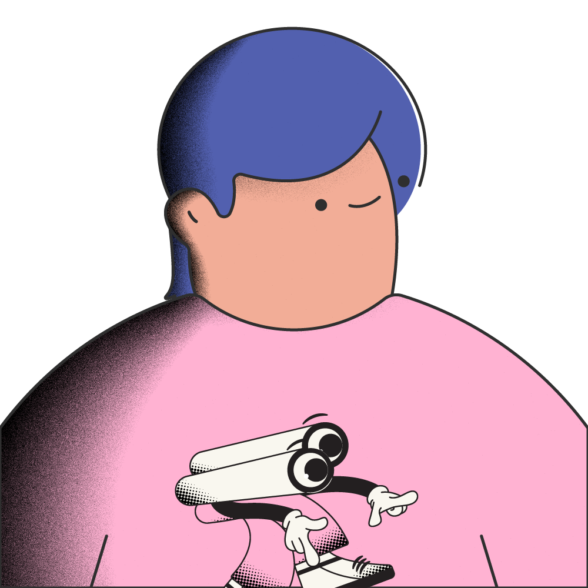

  

<h1 align="center">Hi, I'm Rayhan Nanda 👀</h1>

  iOS developer and game designer building interactive experiences with Swift, SwiftUI, and SpriteKit.

  I enjoy combining technology, visual design, and storytelling to create playful and meaningful experiences.

## About Me

- 🎮 Currently developing **Room 0**
- 🌱 Learning game development and interaction design
- 🦋 Interested in narrative and atmospheric games
- 📱 Exploring interactive experiences for iOS and augmented reality

## Technologies

  
  
  
  
  
  
  

## Featured Projects

### [Room 0](https://github.com/rayhannandaa/Room-0)

A narrative-driven 2D chemistry escape-room game for iOS. A young man wakes inside an unfamiliar room that has been converted into a makeshift laboratory. Players must explore the environment, collect materials, conduct simple experiments, and combine compatible items to solve obstacles while uncovering why the character was brought there.

### [Metamorphosis](https://github.com/rayhannandaa/Metamorphosis)

A top-down survival and discovery game about a human mysteriously transformed into a larva. The player must survive, uncover the room's story, complete their metamorphosis, and escape as a butterfly.

### LightingTrial

An augmented reality learning experience designed to help children understand light and shadow through playful experimentation. Children can observe how light direction and object placement affect shadows, turning an abstract concept into something they can explore directly.

## Connect With Me

  
  
  

## GitHub Stats

  
  

  <picture>
    <source media="(prefers-color-scheme: dark)" srcset="https://raw.githubusercontent.com/rayhannandaa/rayhannandaa/output/github-contribution-grid-snake-dark.svg">
    <source media="(prefers-color-scheme: light)" srcset="https://raw.githubusercontent.com/rayhannandaa/rayhannandaa/output/github-contribution-grid-snake.svg">
    
  </picture>

